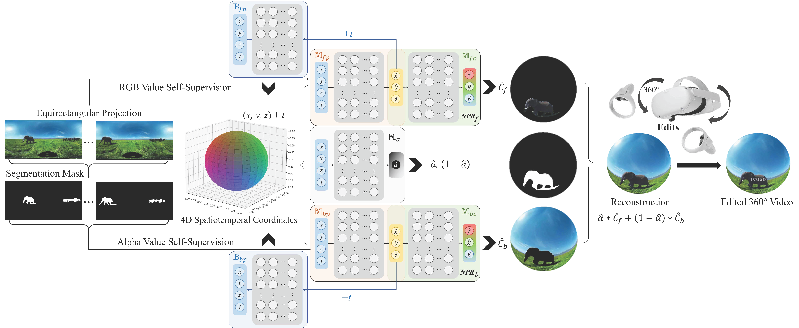

# Neural Panoramic Representation for Spatially and Temporally Consistent 360° Video Editing

Simin Kou, Fang-Lue Zhang, Yu-Kun Lai, Neil A. Dodgson

<p align="left">
  <br>
  <small>The framework of our proposed <strong>N</strong>eural <strong>P</strong>anoramic <strong>R</strong>epresentation (<strong>NPR</strong>).</small> <be> <sub> Our model represents 360° videos using MLPs, allowing for easy video editing in the true spherical space. Given the captured 360° video, its segmentation masks, and the designed 4D spatiotemporal coordinates as inputs, our model predicts implicit spherical positions for generating spherical content layers, providing each layer's appearance for reconstruction. We incorporate bi-directional mapping by introducing an additional pair of backward mapping MLPs to model the global motion of individual dynamic scenes, facilitating flexible 360° video editing.</sub>
</p>

## BibTex
```text
@inproceedings{kou2024neural,
  title={Neural Panoramic Representation for Spatially and Temporally Consistent 360° Video Editing},
  author={Kou, Simin and Zhang, Fang-Lue and Lai, Yu-Kun and Dodgson, Neil A},
  booktitle={2024 IEEE International Symposium on Mixed and Augmented Reality (ISMAR)},
  pages={200--209},
  year={2024},
  organization={IEEE}
}
```
